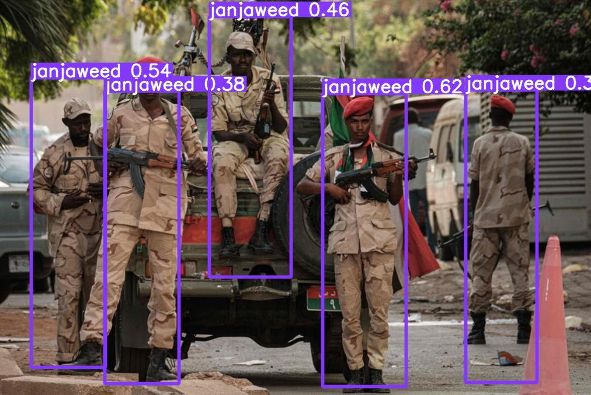

# Janjaweed Detector



<!--  -->


<!--  -->


Janjaweed Detector is a [YOLOv5s](https://github.com/ultralytics/yolov5) object detection model that can recognize and detect members of the notorious Janjaweed militia.

It is intended for educational purposes only.


## Training
The model is a YOLOv5s variant, with 7.2 million parameters. It was finetuned on a diverse set of 57 images (45 for training & 12 for validation) annotated with [LabelImg](https://github.com/heartexlabs/labelImg) tool. Training was run for 300+ epochs. The model achieves fair results when tested:

    Class     Images     Labels        P        R         mAP@.5   mAP@.5:.95:  100% 1/1 [00:00-00:00,  4.07it/s]
    all         12         24         0.755    0.771      0.847      0.403
    janjaweed   12         24         0.755    0.771      0.847      0.403

Improvements can be achieved by adding more images to the dataset and finetuning.


## Installation

* Make sure you have [Python>=3.7.0](https://www.python.org/) installed in your machine.
* Git clone this repo into a suitable directory:
```
git clone https://github.com/H-Sorkatti/janjaweed-detector.git
```
*  cd into the project directory:
```
cd janjaweed-detector
```
* Inside the project create a virtual environmnet:
```
 python -m venv .env
```
* Activate the virtual environment, for example in windows os:
```
.env/Scripts/activate
```
* Install the requirements.txt file:
```
pip install -r requirements.txt
```

## Usage

To run the model on an image or video, use the following command in terminal and make sure you are inside the project folder:
```
python run.py --source "path/to/your/image"
```
The model will run and print the output path of the result. By default it's in `outputs/exp`.
where `exp` folders get incremental numbering after every run.

You can check the options of the script by using `--help` or `-h` flags:
```
python run.py --help
```

```
usage: run.py [-h] [--weights WEIGHTS] [--source SOURCE] [--output-dir OUTPUT_DIR] [--name NAME] [--view-img] [--conf-thres CONF_THRES]
              [--iou-thres IOU_THRES] [--max-det MAX_DET] [--nosave] [--device DEVICE]

optional arguments:
  -h, --help            show this help message and exit
  --weights WEIGHTS     weights to use for the model. best.pt by default
  --source SOURCE       path to image or video to detect
  --output-dir OUTPUT_DIR
                        path to place model output
  --name NAME           name of folder inside outputs
  --view-img            show results on a seperate viewer
  --conf-thres CONF_THRES
                        confidence threshold. 0.25 by default
  --iou-thres IOU_THRES
                        NMS IoU threshold. 0.45 by default
  --max-det MAX_DET     maximum detections per image
  --nosave              do not save images/videos
  --device DEVICE       cuda device, i.e. 0 or 0,1,2,3 or cpu

```

You can use the flags `--conf-thres`, `--iou-thres`, and `--max-det` to control detections.
